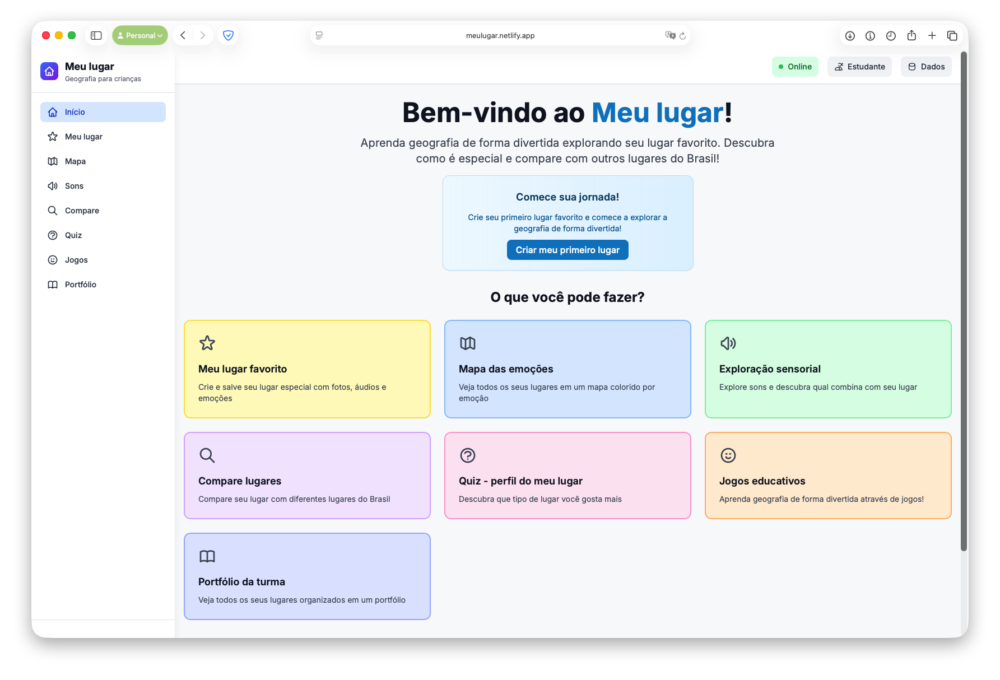
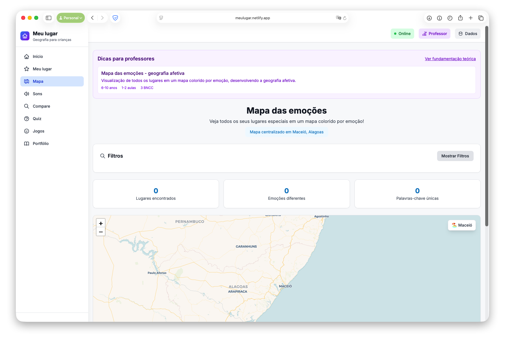
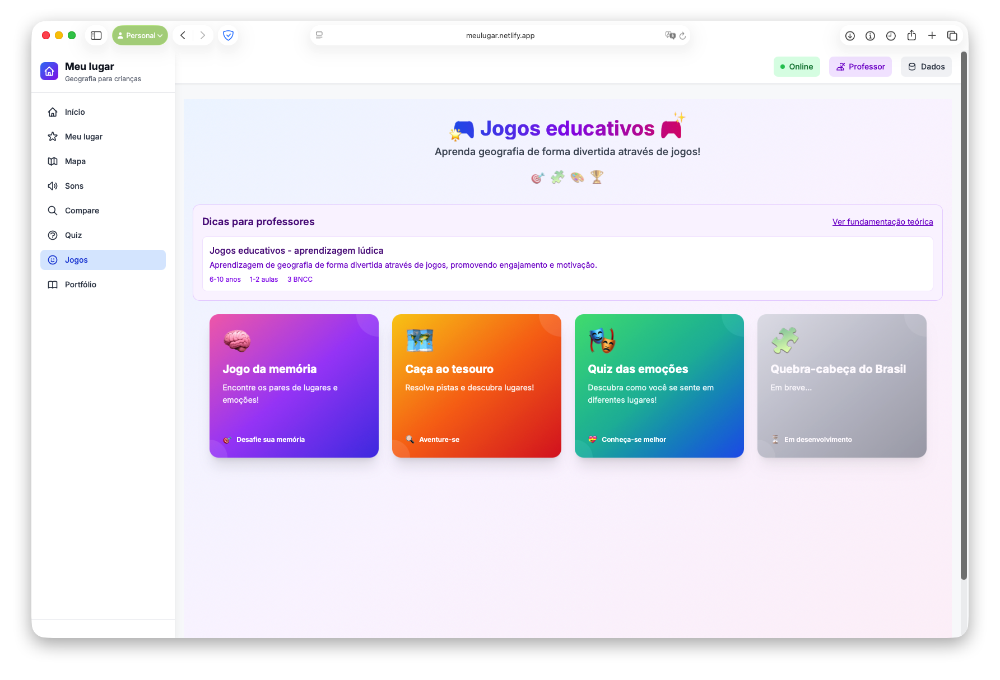

# 🏠 Meu Lugar - Geografia para crianças

> **🌐 [Acesse o site publicado: https://meulugar.netlify.app/](https://meulugar.netlify.app/)**

Uma aplicação web educativa e interativa para ensinar geografia de forma divertida, permitindo que crianças criem, explorem e descubram lugares especiais através de mapas, emoções e jogos.

## 📱 Screenshots do Aplicativo

### 🏠 **Página Inicial**

*Interface principal com módulos educativos e navegação intuitiva*

### 🗺️ **Mapa das Emoções**

*Visualização interativa dos lugares com marcadores coloridos por emoção*

### 🎮 **Jogos Educativos**

*Interface dos jogos com design atrativo e funcionalidades completas*

### 📱 **Responsividade Mobile**
O aplicativo foi desenvolvido com foco em **mobile-first**, garantindo uma experiência perfeita em todos os dispositivos:
- **Menu hamburger** para navegação touch-friendly
- **Layout adaptativo** que se ajusta automaticamente
- **Touch targets** adequados para acessibilidade
- **Performance otimizada** para conexões móveis

## ✨ Funcionalidades Principais

### 🗺️ **Mapa das Emoções**
- **Visualização interativa**: Mapa colorido por emoções
- **Centralizado em Maceió**: Inicia na capital de Alagoas
- **Marcadores personalizados**: Ícones únicos para cada tipo de emoção
- **Filtros inteligentes**: Por emoção e palavras-chave
- **Estatísticas em tempo real**: Contagem de lugares e emoções
- **Validação robusta**: Sistema de fallback para dados inválidos

### 🎮 **Jogos Educativos Completos**
- **Jogo da Memória**: Encontre pares de lugares criados com sistema de pontuação
- **Caça ao Tesouro**: Resolva pistas geográficas com objetivo claro e progressão
- **Quiz das Emoções**: Descubra seu perfil emocional com análise personalizada
- **Quebra-Cabeça do Brasil**: Em desenvolvimento - monte o mapa do Brasil

### ⭐ **Meu Lugar Favorito**
- **Criação completa**: Nome, descrição, emoções e tags
- **Mídia rica**: Fotos e gravações de áudio
- **Localização inteligente**: Mapa interativo para seleção
- **Coordenadas flexíveis**: Copiar, colar e ver no Google Maps
- **URL sharing**: Compartilhe coordenadas entre páginas
- **Emoji padrão**: Ícones automáticos quando não há imagem

### 🔍 **Exploração e Comparação**
- **Exploração Sensorial**: Sons que combinam com lugares
- **Compare Lugares**: Análise de diferentes territórios com emojis contextuais
- **Quiz de Perfil**: Descubra seu tipo de lugar preferido
- **Portfólio da Turma**: Visualização organizada de todos os lugares

### 👨‍🏫 **Modo Professor**
- **Toggle Professor/Estudante**: Interface adaptada para educadores
- **Dicas Pedagógicas**: Fundamentação teórica e orientações práticas
- **Alinhamento BNCC**: Referências curriculares específicas
- **Atividades Sugeridas**: Passo a passo para implementação em sala
- **Materiais Necessários**: Lista de recursos para cada atividade

## 🚀 Tecnologias Utilizadas

- **Frontend**: React 18 + TypeScript
- **Build Tool**: Vite
- **Styling**: Tailwind CSS
- **Mapas**: Leaflet + React-Leaflet
- **Deploy**: Netlify
- **Ícones**: SVG customizados (line icons)
- **Responsividade**: Mobile-first design com breakpoints adaptativos
- **Context API**: Gerenciamento de estado global (modo professor)
- **Local Storage**: Persistência de dados offline
- **PWA Ready**: Funciona offline com dados salvos localmente

## 🎯 Objetivos Educativos

### 📚 **Alinhamento BNCC**
- **EF02GE01**: Identificar e comparar diferentes tipos de lugar
- **EF02GE02**: Observar e descrever paisagens
- **EF02GE03**: Reconhecer símbolos cartográficos básicos

### 🧠 **Desenvolvimento de Habilidades**
- **Memória visual e espacial**
- **Vocabulário geográfico**
- **Relacionamento lugares-emoções**
- **Pensamento lógico e criatividade**
- **Uso de tecnologias digitais**

## 🎮 Como Jogar

### **1. Primeiro Acesso**
1. Acesse [https://meulugar.netlify.app/](https://meulugar.netlify.app/)
2. Clique em "Criar Meu Primeiro Lugar"
3. Preencha as informações do seu lugar especial

### **2. Criando Lugares**
- **Nome**: Escolha um nome significativo
- **Descrição**: Conte por que é especial
- **Emoção**: Como você se sente lá?
- **Tags**: Palavras-chave para organizar
- **Foto**: Capture o momento
- **Áudio**: Grave suas memórias
- **Localização**: Use o mapa interativo

### **3. Explorando o Mapa**
- **Visualização**: Veja todos os lugares coloridos
- **Filtros**: Encontre lugares específicos
- **Interação**: Clique nos marcadores
- **Ações**: Edite, copie coordenadas, crie novos lugares

### **4. Jogando e Aprendendo**
- **Jogo da Memória**: Encontre pares de lugares
- **Caça ao Tesouro**: Resolva pistas geográficas
- **Quiz das Emoções**: Teste seus conhecimentos
- **Pontuação**: Acompanhe seu progresso

## 🎨 Características Visuais

### **Mapa Aprimorado**
- **Tile CARTO Voyager**: Cores vibrantes e detalhes
- **Marcadores personalizados**: Ícones SVG únicos por emoção
- **Validação robusta**: Sistema de fallback para dados inválidos
- **Popups informativos**: Informações completas dos lugares
- **Filtros inteligentes**: Busca por emoção e palavras-chave

### **Interface Responsiva e Moderna**
- **Mobile-first**: Design otimizado para dispositivos móveis
- **Menu hamburger**: Navegação touch-friendly em mobile
- **Sidebar desktop**: Menu lateral fixo em telas grandes
- **Breakpoints adaptativos**: sm (640px), lg (1024px)
- **Touch targets**: Botões com mínimo 44px para acessibilidade
- **Cores acessíveis**: Contraste adequado para todas as idades
- **Animações suaves**: Transições e hover effects
- **Line icons**: Ícones SVG consistentes em toda interface

### **Design System**
- **Cores primárias**: Gradientes azul, roxo e rosa
- **Tipografia**: Inter font com hierarquia clara
- **Espaçamento**: Sistema de padding e margin consistente
- **Cards responsivos**: Adaptação automática ao tamanho da tela
- **Botões adaptativos**: Tamanhos adequados para cada dispositivo

## 👨‍🏫 Para Professores

### **🎯 Modo Professor**
- **Toggle dedicado**: Interface adaptada para educadores
- **Dicas pedagógicas**: Fundamentação teórica baseada em Libâneo, Cavalcanti, Moraes e Merenne-Schoumaker
- **Orientações práticas**: Passo a passo para implementação em sala de aula
- **Alinhamento BNCC**: Referências curriculares específicas para cada atividade
- **Materiais necessários**: Lista completa de recursos para cada módulo
- **Duração estimada**: Tempo sugerido para cada atividade

### **📚 Fundamentação Teórica**
- **Libâneo (2006)**: Sala de aula como coração do sistema educacional
- **Cavalcanti (1998)**: Lugar como espaço vivido e experienciado
- **Moraes (2019)**: Geografia contextualizada e pensamento científico
- **Merenne-Schoumaker (1999)**: Triângulo didático (professor-aluno-saber)

### **🎯 Atividades Sugeridas**
- **Saída de campo**: Observação e registro de lugares
- **Construção coletiva**: Mapas colaborativos da turma
- **Comparação de territórios**: Análise de diferentes regiões
- **Jogos educativos**: Atividades de aquecimento e revisão
- **Exploração sensorial**: Desenvolvimento da percepção pelos sentidos
- **Reflexão emocional**: Conexão entre lugares e sentimentos

### **📊 Avaliação**
- **Portfólio digital**: Acompanhe o progresso dos alunos
- **Criatividade**: Avalie a expressão através de mídia
- **Compreensão geográfica**: Verifique o entendimento de conceitos
- **Colaboração**: Promova o compartilhamento de experiências
- **Auto-reflexão**: Quiz das emoções para autoconhecimento

## 🔧 Instalação e Desenvolvimento

### **Pré-requisitos**
- Node.js 18+ 
- npm ou yarn

### **Passos para instalação**
```bash
# Clone o repositório
git clone https://github.com/rutecintra/meu-lugar.git

# Entre na pasta
cd meu-lugar

# Instale as dependências
npm install

# Execute em modo desenvolvimento
npm run dev

# Build para produção
npm run build
```

### **Scripts disponíveis**
- `npm run dev`: Servidor de desenvolvimento
- `npm run build`: Build de produção
- `npm run preview`: Preview do build
- `npm run lint`: Verificação de código

## 📱 Compatibilidade

### **Dispositivos Suportados**
- **Desktop**: Windows, macOS, Linux (Chrome, Firefox, Safari, Edge)
- **Tablet**: iPad, Android tablets (640px - 1024px)
- **Mobile**: iPhone, Android phones (< 640px)
- **Responsividade**: Breakpoints adaptativos automáticos

### **Recursos Mobile**
- **Menu hamburger**: Navegação touch-friendly
- **Touch targets**: Botões com mínimo 44px para acessibilidade
- **Gestos**: Swipe e tap otimizados
- **Performance**: Carregamento rápido em conexões lentas
- **Offline**: Funciona sem internet com dados salvos localmente

### **Navegadores**
- **Chrome**: 90+ (recomendado)
- **Firefox**: 88+
- **Safari**: 14+
- **Edge**: 90+
- **Mobile browsers**: iOS Safari, Chrome Mobile

## 🌟 Recursos Especiais

### **Localização Inteligente**
- **GPS automático**: Detecta localização atual
- **Coordenadas manuais**: Digite latitude e longitude
- **Mapa interativo**: Clique para selecionar
- **Google Maps**: Visualize no mapa externo
- **Validação**: Sistema de fallback para dados inválidos

### **Mídia Rica e Organização**
- **Fotos**: Suporte a múltiplos formatos
- **Áudio**: Gravação direta no navegador
- **Preview**: Visualização antes de salvar
- **Emoji padrão**: Ícones automáticos quando não há imagem
- **Organização**: Referências automáticas

### **Jogos Educativos Avançados**
- **Jogo da Memória**: Sistema de pontuação e movimentos
- **Caça ao Tesouro**: Objetivo claro com progressão e recompensas
- **Quiz das Emoções**: Análise de perfil com animais personalizados
- **Feedback inteligente**: Dicas e correções contextuais
- **Progressão**: Desafios crescentes baseados no conteúdo

### **Interface Adaptativa**
- **Modo Professor**: Interface dedicada para educadores
- **Responsividade**: Adaptação automática a qualquer dispositivo
- **Acessibilidade**: Touch targets adequados e contraste otimizado
- **Performance**: Carregamento otimizado para conexões lentas
- **Offline**: Funciona completamente sem internet

## 🆕 Melhorias Recentes

### **v2.0 - Responsividade Total**
- **✅ Menu Mobile**: Menu hamburger com animações suaves
- **✅ Layout Adaptativo**: Sidebar desktop + menu mobile
- **✅ Touch-Friendly**: Botões com área de toque adequada
- **✅ Breakpoints**: sm (640px), lg (1024px) automáticos
- **✅ Performance**: Otimização para carregamento rápido

### **v1.5 - Modo Professor**
- **✅ Toggle Professor/Estudante**: Interface adaptada
- **✅ Dicas Pedagógicas**: Fundamentação teórica completa
- **✅ Alinhamento BNCC**: Referências curriculares
- **✅ Atividades Práticas**: Passo a passo para implementação

### **v1.3 - Jogos Completos**
- **✅ Jogo da Memória**: Sistema de pontuação funcional
- **✅ Caça ao Tesouro**: Objetivo claro com progressão
- **✅ Quiz das Emoções**: Análise de perfil personalizada
- **✅ Feedback Inteligente**: Dicas e correções contextuais

### **v1.1 - UI/UX Melhorada**
- **✅ Line Icons**: Ícones SVG consistentes
- **✅ Validação Robusta**: Sistema de fallback
- **✅ Emoji Padrão**: Ícones automáticos para lugares
- **✅ Design System**: Cores e tipografia consistentes

## 🚀 Deploy e Publicação

### **Netlify**
- **URL**: [https://meulugar.netlify.app/](https://meulugar.netlify.app/)
- **Build automático**: Integração com GitHub
- **HTTPS**: Certificado SSL automático
- **CDN global**: Performance otimizada

### **Configurações de Build**
- **Build command**: `npm run build`
- **Publish directory**: `dist`
- **Node version**: 18.x

### **Configuração de Rotas (SPA)**
- **Arquivo `_redirects`**: Redireciona todas as rotas para `index.html`
- **Arquivo `netlify.toml`**: Configuração avançada do Netlify
- **Solução**: Resolve problema de "Page Not Found" em rotas diretas
- **Documentação**: Veja [DEPLOY.md](DEPLOY.md) para detalhes completos

## 🤝 Contribuição

### **Como contribuir**
1. Faça um fork do projeto
2. Crie uma branch para sua feature
3. Commit suas mudanças
4. Push para a branch
5. Abra um Pull Request

### **Áreas para contribuição**
- **Novos jogos**: Ideias para jogos educativos
- **Melhorias de UI/UX**: Sugestões de interface
- **Funcionalidades**: Novas features educativas
- **Documentação**: Melhorias no README
- **Testes**: Cobertura de testes

## 📄 Licença

Este projeto está sob a licença MIT. Veja o arquivo [LICENSE](LICENSE) para mais detalhes.

## 🙏 Agradecimentos

- **Comunidade React**: Pela excelente documentação e ecosystem
- **Leaflet**: Pela biblioteca de mapas open-source robusta
- **Tailwind CSS**: Pelo framework CSS utilitário e responsivo
- **Netlify**: Pela plataforma de deploy gratuita e confiável
- **Vite**: Pela ferramenta de build rápida e moderna
- **TypeScript**: Pela tipagem estática e melhor DX
- **Professores**: Pelo feedback valioso e sugestões educativas
- **Comunidade Open Source**: Pelo suporte e contribuições

## 📞 Contato

- **GitHub**: [@rutecintra](https://github.com/rutecintra)
- **Projeto**: [https://github.com/rutecintra/meu-lugar](https://github.com/rutecintra/meu-lugar)
- **Site**: [https://meulugar.netlify.app/](https://meulugar.netlify.app/)

---

**⭐ Se este projeto te ajudou, considere dar uma estrela no GitHub!**

*Desenvolvido com ❤️ para tornar o aprendizado de geografia mais divertido, interativo e acessível em qualquer dispositivo.*

### 🎯 **Próximos Passos**
- **PWA**: Transformar em Progressive Web App
- **Mais Jogos**: Expandir biblioteca de jogos educativos
- **Colaboração**: Modo multiusuário para turmas
- **Analytics**: Dashboard para professores acompanharem progresso
- **Internacionalização**: Suporte a múltiplos idiomas
